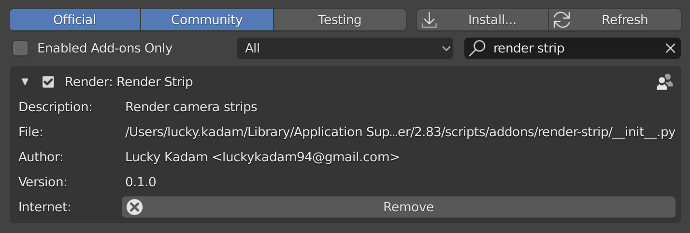
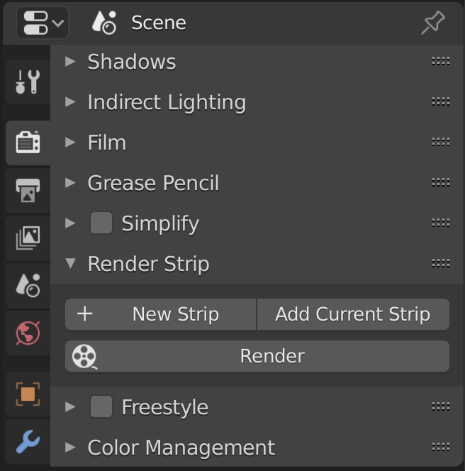

# Render Strip
**Render all camera animations in one click.** A minimal add-on for Blender 2.80+

Author: [Lucky Kadam](https://twitter.com/luckykadam94)

## Installation

1. Download from [Gumroad](https://gumroad.com/l/renderstrip) for free or Github latest [release](https://github.com/luckykadam/render-strip/archive/v0.2.0.zip) (do not unzip).
2. In blender, go to: Edit -> Preferences -> Add-ons -> Install.
3. Select the downloaded file and click on -> Install Add-on.
4. Enable it by clicking on checkbox.

You should now see Render Strip tab in Render Properties.

## Usage

1. Create new strip by clicking on New Strip.
2. Specify the camera, start frame and end frame. (Optionally name the strip by clicking on `pencil` icon).
3. Select the output path.
4. Hit Render.

5. For more control on ouptut, take a look at output settings sub-panel.

## Resources

* Demonstration video on [Youtube](https://youtu.be/4OC895dGW0g)
* Support thread on [BlenderArtists](https://blenderartists.org/t/render-strip/1245609)

## Feedback

Feel free to report issues or provide feedback on Github.
