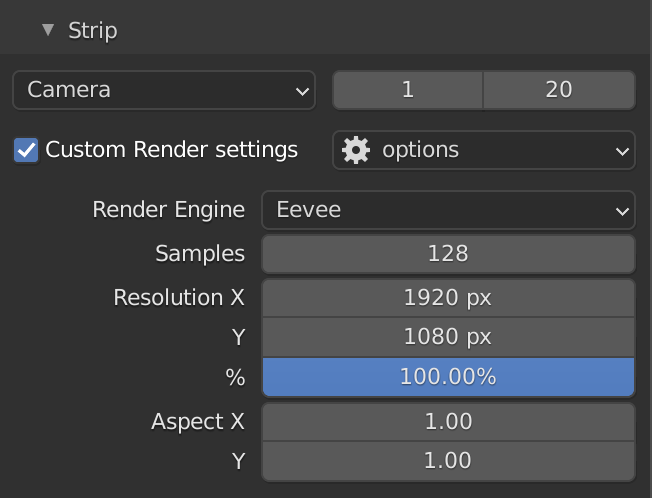
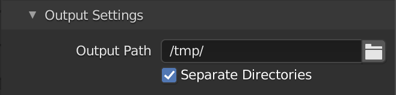

# Render Strip
**Blender addon to manage animation strips.**

Author: [Lucky Kadam](https://twitter.com/luckykadam94)

## Installation

1. Download from [Gumroad](https://gumroad.com/l/renderstrip) for free or Github latest [release](https://github.com/luckykadam/render-strip/releases/download/v1.0/render-strip-v1.0.zip) (do not unzip).
2. In blender, go to: Edit -> Preferences -> Add-ons -> Install.
3. Select the downloaded file and click on -> Install Add-on.
4. Enable it by clicking on checkbox.

You should now see Render Strip panel in Render Properties.

## Usage

1. Create new strip by clicking on "+" button.
2. Specify the camera, start frame and end frame.
3. Select the output path.
4. Hit Render.

5. Optionally set custom render settings for the strip.

6. For more control on ouptut, take a look at output settings sub-panel.

## Resources

* Demonstration video on [Youtube](https://youtu.be/4OC895dGW0g)
* Support thread on [BlenderArtists](https://blenderartists.org/t/render-strip/1245609)

This project is inspired by [Render Burst](https://github.com/VertStretch/RenderBurst).

## Feedback

Feel free to report issues or provide feedback on Github.
