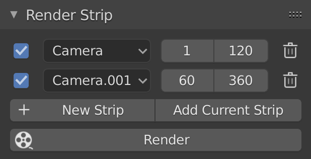

# Render Strip
**Render all camera animations in one click.** A minimal add-on for Blender 2.80+

Author: [Lucky Kadam](https://twitter.com/luckykadam94)

## Installation

1. Download add-on [release](https://github.com/luckykadam/render-strip/releases/download/0.1.0/render-strip-0.1.0.zip) (do not unzip).
2. In blender, go to: Edit -> Preferences -> Add-ons -> Install.
3. Select the downloaded file and click on -> Install Add-on.
4. Enable it by clicking on checkbox.

You should now see Render Strip tab in Render Properties.

## Usage

1. Create new strip by clicking on New Strip.
2. Specify the camera, start frame and end frame.
3. Hit Render.

## Feedback

Feel free to report issues or provide feedback on Github.
